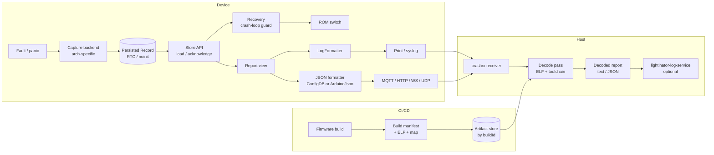

# Crash Report Module Plan

Status: proposed; implementation not started.
Created: 2026-10-06.

## Objective

Move the crash capture code out of `esp_rgbww_firmware/app/application.cpp` into a
standalone, firmware-agnostic Sming module that:

1. captures crash state in the exception/panic path and persists it across reset,
2. replays a captured crash in multiple formats after reboot:
   - the plain log print used today (byte-compatible with current consumers),
   - JSON from a dedicated `crash-report` schema, rendered through ConfigDB or
     ArduinoJson, selected at compile time,
3. detects crash loops and backs out to the other ROM (the crash-loop guard moves
   into the module, giving one library for capture, decode and recovery),
4. mid term, ships its own local receiver and decode pass, so a developer can
   catch and symbolize crashes without running lightinator-log-service,
5. makes every crash decodable after the fact: the record identifies the exact
   firmware and Sming build, and a CI workflow plus a CD step publish the
   matching ELF and map files in a structured, immutable location.

Relates to [FIRMWARE_AGNOSTIC_PLAN.md](FIRMWARE_AGNOSTIC_PLAN.md): the JSON
record is the first concrete "crash format" contract for that plan's
platform/format decoder layer.

## Current State (esp_rgbww_firmware, branch `experimental`)

All crash code lives in `app/application.cpp`, mixed with partition setup,
crash-loop guard and telemetry:

| Piece | Location | Notes |
| --- | --- | --- |
| `struct CrashDump` | application.cpp ~L167 | 10 metadata words + `CRASH_STACK_WORDS` (50) = 240 bytes |
| `custom_crash_callback()` | application.cpp ~L184 | Overrides Sming weak alias in `Arch/Esp8266/Components/esp8266/crash_handler.c`; ESP8266 only |
| `Application::readCrashDump()` | application.cpp ~L1010 | Called in `onReady()`; copies RTC → `g_crashDump`, clears magic immediately |
| `Application::reportCrashDump()` | application.cpp ~L1117 | Called in `startServices()`; prints via `cdebug_w/e`; falls back to `rst_info` |
| Constants | include/RGBWWCtrl.h L209-232 | `CRASH_RTC_SLOT 68`, magics, word counts; `CRASHLOOP_RTC_SLOT 128` |
| Telemetry reboot fields | application.cpp ~L487 + params.cfgdb `telemetry-reboot` | Duplicates `rst_info` subset (reason, exccause, epc1-3, excvaddr, depc) |
| Crash-loop guard | application.cpp ~L235, ~L1025, ~L1104 | `CrashLoopGuard` in RTC slot 128 (ESP8266) / `RTC_NOINIT_ATTR` (ESP32); `checkCrashLoop()`, `markFirmwareHealthy()`; moves into the module |

Artifact publishing today (esp_rgbww_firmware workflows):

- `build_firmware.yml` uploads firmware, `app_0.out`/`app.out` and `.map` per
  SOC/build type as GitHub Actions artifacts.
- `deploy-pages.yml` copies them to
  `download/firmware/<branch>/<version>/<soc>/<debug|release>/` and maintains
  `version.json` via `manage_version.py`, including a `cull` step that removes
  old versions.
- lightinator-log-service `src/crashDecoder.js` derives the ELF URL from
  `git_version` (branch parsed from the version string) and fetches Sming
  source context from `sming_version || "develop"`.

Gaps: no checksum, no firmware or Sming commit recorded, Sming falls back to
a moving branch, and culled versions make older crashes undecodable.

Consumers of the current text format:

- lightinator-log-service `src/crashDecoder.js` `CRASH_TRIGGER_RE`:
  `pc=0x… sp=0x… excvaddr=0x…` and `epc1=0x…`.
- `tools/decode-esp8266.py` / Sming `decode-stacktrace.py`: `pc=` line plus
  `%08x:  %08x %08x %08x %08x` stack rows.

### Issues found in the existing code (fix during extraction)

1. **Stack-local record in the fault path.** `CrashDump dump{}` (240 bytes) is
   allocated on the faulting stack. On stack overflow this can cause a nested
   fault before anything is persisted. Use a static/`.noinit` buffer instead.
2. **`stack_end` is trusted unchecked.** Only `stack` is range-checked;
   `stack_end` (hard-coded `0x3fffffb0` by Sming today) should be clamped to the
   DRAM end, and `stack <= stack_end` verified.
3. **Destructive read.** `readCrashDump()` clears the RTC magic in `onReady()`
   before anything has been delivered. A crash that happens again before
   `startServices()`, or a lost UDP syslog packet, loses the dump. Replace with
   explicit `acknowledge()` after successful delivery.
4. **No integrity check.** Only a magic word guards RTC contents; a torn write or
   stale layout from an older firmware is accepted. Add version, size and CRC.
5. **Layout comment is stale.** Comment says `stackWords[53]` / 256 bytes and
   "crash dump uses 64-127"; actual is 60 words at slots 68-127, ending exactly
   at `CRASHLOOP_RTC_SLOT` (128). Any growth silently collides — needs a
   `static_assert` against the neighbour slot.
6. **No ESP32 / Host capture.** ESP32 relies on IDF's panic print only; nothing
   is persisted or replayed. Host has nothing to test against.
7. **No build identity in the record.** The decoder has to guess the ELF from
   syslog metadata; the record should carry a build ID that resolves to the
   exact firmware and Sming commits and their ELF/map files.
8. **Formatting duplicated** across the normal, overflow and fallback paths, and
   tightly bound to `cdebug_*` and the `Application::reportCrashDump:` prefix.

## Target Architecture



Separation rules:

- **Capture** knows the architecture, nothing about output.
- **Record** is a versioned POD; the only thing shared between the fault path
  and normal runtime.
- **Report** is a read-only, arch-neutral view over a Record (names registers,
  exposes stack words, kind, build ID).
- **Formatters** only read a Report. They never touch RTC or globals.
- **Recovery** reads the reset reason / Report and owns its own RTC state; it
  never formats or transmits.
- **Transports** are the application's job (or optional thin sinks in the module).
- **Receiver/decoder** consume the formatted output; JSON is primary, legacy
  text is supported through an adapter.

## Module Layout (standalone repo, e.g. `~/devel/CrashReport`)

```
CrashReport/
  component.mk                     Sming component; CRASHREPORT_JSON selects backend
  README.rst
  schema/
    crash-report.schema.json       canonical JSON Schema for the report
    crash-report.cfgdb             $defs only, $ref'd from the app's ConfigDB schema
    build-manifest.schema.json     CI/CD build manifest contract
  src/include/CrashReport/
    Record.h                       persisted POD, versioned
    Report.h                       read-only view
    Store.h                        load / acknowledge / clear
    BuildInfo.h                    compiled-in build identity
    LogFormatter.h                 legacy text replay
    ConfigDBFormatter.h            header-only template filler (CRASHREPORT_JSON=configdb)
    ArduinoJsonFormatter.h         JsonObject filler (CRASHREPORT_JSON=arduinojson)
    Recovery.h                     crash-loop guard / ROM backout
  src/Arch/Esp8266/Capture.cpp     custom_crash_callback, RTC user memory
  src/Arch/Esp32/Capture.cpp       panic hook, RTC_NOINIT_ATTR
  src/Arch/Host/Capture.cpp        signal handler / test injection
  src/Arch/*/RecoveryStore.cpp     per-arch persistence for the guard
  src/LogFormatter.cpp
  src/ArduinoJsonFormatter.cpp
  src/Recovery.cpp
  tools/
    gen-build-manifest.py          used by make and CI
    publish/                       reusable CI/CD workflow + scripts
  host/
    crashrx/                       local receiver (Python package)
    decoders/                      moved from lightinator-log-service tools/
    artifacts/                     manifest/ELF resolver shared by decoders
  test/                            Host-arch unit tests, golden files
  samples/Basic_Crash/             minimal app: deliberate faults, replay all formats
```

The module must not depend on RGBWWCtrl, `app`, `cdebug_*` or the JSON-RPC codec.
ConfigDB and ArduinoJson are optional dependencies, pulled in only by the
selected backend. ROM switching uses Sming's OTA/partition API through a small
interface so the app can veto or customise it.

## Persisted Record (v1)

Fixed-size POD, written once from the fault path:

| Field | Type | Notes |
| --- | --- | --- |
| `magic` | u32 | single magic; overflow becomes a flag |
| `version` | u16 | layout version |
| `size` | u16 | `sizeof(Record)`; rejects layouts from other builds |
| `crc` | u32 | CRC32 over the record with `crc = 0`; computed in the fault path (small table-less CRC in IRAM) |
| `arch` | u8 | esp8266 / esp32 / esp32s3 / esp32c3 / host … |
| `kind` | u8 | exception, softWdt, hwWdt, panic, abort, stackOverflow, unknown |
| `flags` | u16 | `stackInvalid`, `truncated`, … |
| `bootCount` / `sequence` | u32 | detects duplicates and re-delivery |
| `buildId` | u8[8] or u32[2] | key into the artifact store; matches the build manifest (see Build Identity) |
| `reason`, `cause` | u32 | `rst_info.reason` / `exccause` (ESP32: reset reason + panic cause) |
| `pc`, `sp`, `faultAddr` | u32 | normalized core registers |
| `archRegs[4]` | u32 | lx106: epc2, epc3, depc, ps; ESP32: arch-defined set |
| `stackBase`, `stackCount` | u32 | |
| `stack[N]` | u32 | N per arch; ESP32 may store backtrace PC/SP pairs instead (flag) |

Placement:

- ESP8266: RTC user memory, slot and size from component config
  (`CRASHREPORT_RTC_SLOT`, `CRASHREPORT_STACK_WORDS`), with a `static_assert`
  that the record ends before the Recovery state. The module owns the whole RTC
  layout (crash record + guard) and asserts it does not overlap rBoot's slots.
- ESP32: `RTC_NOINIT_ATTR` variable (survives panic/WDT, garbage after power-on
  → CRC rejects it).
- Host: file or in-memory, for tests.

## Capture Backends

### ESP8266

- Keep the `custom_crash_callback(rst_info*, stack, stack_end)` override.
- Write into a static record buffer, not a stack local.
- Validate `stack` and clamp `stack_end` to DRAM bounds; set `stackInvalid`
  instead of the separate overflow magic.
- Compute CRC, then `system_rtc_mem_write()`. No logging, no allocation, no
  flash-cache-dependent code (verify the callback and CRC end up in IRAM, or that
  cache is guaranteed enabled at this point).
- Document interaction with Sming's `debug_crash_callback` and `__stack_chk_fail`
  (the latter calls `system_restart()` and therefore bypasses capture today;
  route it through capture with `kind = stackOverflow`).

### ESP32 (phase 4)

- Hook the panic path (e.g. `-Wl,--wrap=esp_panic_handler` or the IDF panic
  hook available in the Sming IDF version), take the exception frame registers
  and walk the backtrace with `esp_backtrace_*`.
- Store backtrace frames rather than raw stack words.
- Use `esp_reset_reason()` for `reason`. Task WDT / abort / assert map to `kind`.
- Decide whether to coexist with IDF core dump to flash (out of scope for v1).

### Host

- Signal handler (SIGSEGV/SIGABRT) for emulator runs, plus an explicit
  `CrashReport::inject(Record)` used by unit tests.

## Runtime API (sketch, not final)

- `CrashReport::Store::load()` → optional Report; validates magic/version/size/CRC.
- `Store::pending()` → bool, without copying.
- `Store::acknowledge(sequence)` → clears only after successful delivery.
- `Store::fromResetInfo()` → synthesizes a minimal Report from `rst_info` /
  `esp_reset_reason()` when no record exists (replaces the current fallback path).
- Report accessors: kind, arch, reason, cause, pc, sp, faultAddr, named arch
  registers, stack iterator, buildId, flags.

## Replay Format 1: Plain Log (LogFormatter)

- Output target is a Sming `Print&` (or a line callback), so the app can route
  it to `cdebug_w`, `Serial`, or the UDP syslog stream.
- Configurable line prefix; default reproduces the current
  `Application::reportCrashDump: ` prefix during migration.
- Colour on/off (ANSI codes currently embedded).
- Must reproduce today's lines exactly, including:
  - `pc=0x%08x sp=0x%08x excvaddr=0x%08x`
  - `epc1=… epc2=… epc3=… exccause=… depc=… reason=…` variants
  - `*** STACK POINTER OUT OF BOUNDS ***`, `*** CRASH REBOOT DETECTED ***`
  - `Stack dump:` followed by `%08x:  %08x %08x %08x %08x` rows, zero-padded last row.
- Golden-file tests against captured current output, and against
  `crashDecoder.js` `CRASH_TRIGGER_RE` and `decode-esp8266.py`.
- Optionally append a single `crash-id=<buildId>:<sequence>` line (new, ignored
  by old parsers) so the receiver can deduplicate.

## Replay Format 2: JSON (ConfigDB or ArduinoJson)

Backend chosen at compile time:

```make
CRASHREPORT_JSON ?= none        # none | configdb | arduinojson
```

Both backends emit the same document, defined once by
`schema/crash-report.schema.json`. The `.cfgdb` file mirrors it for ConfigDB code
generation; a test fails if the two drift. Field names, address encoding and
optional-field rules are identical, so receivers never need to know which
backend the device used.

### Schema

```
crash-report
  formatVersion       integer
  arch                string enum
  kind                string enum
  sequence            integer
  buildId             string (hex)
  reason              integer
  cause               integer
  registers           object  { pc, sp, faultAddr, epc2, epc3, depc, … } (arch-optional)
  stack               object  { base, valid, truncated, words: array<integer> }
  backtrace           array<object { pc, sp }>   (ESP32)
  build               object  { buildId, fwVersion, fwCommit, smingVersion,
                                smingCommit, soc, buildType }  (from BuildInfo)
```

### ConfigDB backend

A `$defs`-only `crash-report.cfgdb`, following the existing `value-types` /
`params` pattern in esp_rgbww_firmware.

- App adds the module's schema path to `CONFIGDB_SCHEMA` and references
  `crash-report/$defs/crash-report` from its own root (in esp_rgbww_firmware:
  a `crash_report` member in `jsonrpc.cfgdb`, next to `telemetry`).
- `ConfigDBFormatter` is a header-only template:
  `template <class Updater> bool fill(Updater&, const Report&)`. Generated
  setter names are identical wherever the `$defs` are embedded, so the module
  never names app-generated classes.
- App renders with its existing `RpcCodec::render()` / `renderPayload()` and
  sends over MQTT/WebSocket/HTTP. The module may offer a minimal standalone
  database for apps without their own ConfigDB root.
- `telemetry-reboot` can later be replaced by a `$ref` to a subset of
  `crash-report` to remove the duplication.

### ArduinoJson backend

For apps without ConfigDB (esp_rgbww_firmware already links `ArduinoJson6`).

- `bool fill(JsonObject, const Report&)` plus a convenience
  `size_t serialize(const Report&, Print&)` that streams without building a
  `String`.
- Fixed `StaticJsonDocument` capacity derived from `CRASHREPORT_STACK_WORDS`,
  checked with `static_assert`; serialization failure is reported, not truncated
  silently.
- Pin to the ArduinoJson major version Sming ships (v6 today); v7 support is a
  separate decision.

### To verify before implementing

- ConfigDB integer range: `non-negative-integer` must hold full u32 addresses
  (0x40xxxxxx, 0x3FFxxxxx). If it is int32-backed, encode addresses as hex
  strings or use an explicit u32 type.
- A `$defs`-only `.cfgdb` in `CONFIGDB_SCHEMA` must not generate an unwanted
  persistent store (check what `value-types.cfgdb` generates today).
- Array-of-integer append API and RAM cost for 50-60 stack words on ESP8266;
  render in one pass, never keep the full JSON string around longer than needed.
- Rendering from `startServices()` must respect the codec's single-message rule.
- ArduinoJson: peak heap/stack of the document for the largest record on
  ESP8266 after a crash-induced reboot (heap may already be tight).

## Recovery: Crash-Loop Guard and Backout

Moved from `application.cpp` unchanged in behaviour first, then generalised.

- State (`magic`, `bootCount`, `switchCount`) lives next to the crash record in
  module-owned RTC/noinit memory; per-arch persistence as today (ESP8266 RTC user
  memory, ESP32 `RTC_NOINIT_ATTR`, Host in-memory).
- API: `Recovery::checkOnBoot(resetInfo)` early in `onReady()`;
  `Recovery::markHealthy()` from an app timer; configurable threshold,
  healthy time and switch budget (today `CRASHLOOP_THRESHOLD`,
  `CRASHLOOP_HEALTHY_MS`, `CRASHLOOP_MAX_SWITCHES`).
- Backout through an interface (`switchToOtherRom()`), default implementation
  using Sming OTA; the app can veto (e.g. during an OTA in progress).
- Recovery decisions are recorded in the next crash report (`flags`:
  `romSwitched`, `switchBudgetExhausted`, plus the running and previous
  partition), so the receiver sees that a backout happened and which build
  crashed.
- Later: use `Report::kind` to weight real exceptions differently from
  unexplained resets, while keeping today's "count every non-deliberate
  reboot" default.

## Build Identity and Artifact Publishing (CI/CD)

Decoding needs the exact ELF and map of the crashed build, and source context
needs the exact firmware and Sming commits. Version strings and branch names
are not enough.

### Build identity on the device

- `BuildInfo` compiled into the firmware: `buildId`, firmware version and commit,
  Sming version/tag and commit, SOC, build type, single-image flag.
- Generated by the module's make rules (`gen-build-manifest.py`) from
  `git describe` / `git rev-parse` of the app and `$(SMING_HOME)`, plus dirty flags.
- `buildId` must be readable at runtime and reproducible from the artifacts.
  Options: GNU `--build-id` note exposed via a linker-script symbol (ESP8266
  linker scripts must keep the note), or a pre-link hash of inputs embedded as a
  constant and stored in the manifest. Open decision below.
- The record carries `buildId`; the JSON report and the boot announcement carry
  the full `BuildInfo`. The legacy text format adds one `build-id=` line.

### Build manifest

One `build-manifest.json` per firmware binary, validated against
`schema/build-manifest.schema.json` and aligned with FIRMWARE_AGNOSTIC_PLAN's
Build Manifest Contract:

- schema version, project ID, `buildId`
- firmware repo, commit, branch, version string, dirty flag
- Sming repo, commit, tag; submodule/component commits
- SOC, build type, single-image flag, partition layout
- toolchain identity and version (e.g. esp-quick-toolchain, IDF version)
- crash record version and decoder profile (`esp8266-lx106`, `esp32-xtensa`, `esp32-riscv`)
- artifacts: ELF, map, firmware image; relative path, size, sha256
- source-path mappings (build paths → repo-relative paths)

Local `make` writes the same manifest into `out/<Arch>/<build>/build/`, so
`crashrx` works against a developer build without CI.

### CI (build workflow)

- Reusable workflow / composite action shipped in the module
  (`tools/publish/`), called from `build_firmware.yml` after each matrix build.
- Generates and validates the manifest, checksums ELF/map, uploads them with the
  firmware artifact.
- Fails the build if `buildId` in the binary and in the manifest differ.

### CD (publish step)

- Extends `deploy-pages.yml`: in addition to the existing
  `download/firmware/<branch>/<version>/<soc>/<type>/` tree (kept for OTA and
  legacy decoding), publish a content-addressed store:

  ```
  builds/<buildId>/manifest.json
  builds/<buildId>/app.out
  builds/<buildId>/app.map
  index/<projectId>/<version>/<soc>/<type>.json   -> { buildId }
  ```

- Immutable: a `buildId` path is never overwritten. `version.json cull` must not
  delete `builds/` entries; debug-artifact retention is a separate, longer policy.
- HTTPS only; decoders verify sha256 from the manifest before use. Signing the
  manifest is a later step.
- Store location is configurable (lightinator.de today; GitHub Releases or an
  OCI registry are alternatives), so other firmware projects can reuse the
  workflow.

### Resolution in decoders

1. explicit `--elf` / `--manifest`
2. local build tree (manifest with matching `buildId`)
3. local artifact cache (`builds/<buildId>/`)
4. remote artifact store by `buildId`
5. legacy path from version/branch/SOC/type (today's `crashDecoder.js` behaviour),
   marked as unverified

Source context (AI analysis, snippets) uses the manifest's firmware and Sming
commits instead of `develop`.

## Delivery and Acknowledgement

- App decides the transport; module provides the record and the ack call.
- Suggested firmware policy:
  - Always print the log format once on boot (serial/syslog, best effort).
  - Send JSON over a reliable path (MQTT QoS1 or HTTP POST to the receiver);
    `acknowledge()` only on confirmed delivery.
  - Retry on subsequent connects; give up after N boots (counter in the record
    header) so a broken receiver cannot pin the record forever.
- A new crash overwrites an unacknowledged one; set `flags.overwrotePending` so
  the loss is visible.

## Mid Term: Local Receiver and Decode Pass

Goal: a developer runs one command next to the build tree and sees decoded
crashes, without lightinator-log-service, Loki or Grafana.

### Receiver (`host/crashrx`)

- Python package/CLI (`crashrx`), no service dependencies.
- Inputs:
  - UDP syslog (RFC 3164/5424) — reuses the legacy text format.
  - UDP/HTTP JSON (`crash-report` schema) — primary.
  - Serial port (`--serial /dev/ttyUSB0`), sharing the line parser.
  - File/stdin replay for captured logs and tests.
- Reassembles multi-line text reports per source, keyed by source + boot;
  validates JSON against `crash-report.schema.json`.
- Deduplicates by `buildId + sequence`.
- Outputs decoded report to terminal (coloured), and optionally writes
  `crash-<timestamp>.json` / `.txt` to a directory.
- Binds to localhost by default; explicit flag to listen on LAN. No command
  execution from received data; size limits on datagrams and HTTP bodies.

### Decode pass (`host/decoders`)

- Move `tools/decode-esp8266.py` and `tools/decode-esp32.py` from this repo into
  the module and refactor:
  - core: `decode(report: dict, elf: Path, toolchain: Toolchain) -> DecodedReport`
    working on the structured JSON report,
  - adapter: legacy text → report dict (current regex parsing),
  - presentation: text (current coloured output) and JSON.
- ELF/map resolution via `host/artifacts` (see "Resolution in decoders").
  Refuse to decode on build-ID or checksum mismatch instead of guessing.
- Toolchain resolution uses the same model as `config/decoder-toolchains.json`
  (no toolchain paths or commands taken from the report).

### Relationship to lightinator-log-service

- Short term: the service keeps its current text path; LogFormatter output stays
  byte-compatible.
- Mid term: the service ingests the JSON report (new endpoint or MQTT topic)
  and calls the module's decoder package instead of its own copies in `tools/`.
  `src/crashDecoder.js` keeps the legacy-text path for old firmware.
- ELF lookup switches from the version-derived URL to `buildId` resolution;
  source context uses manifest commits instead of `sming_version || "develop"`.
- `crashFingerprint.js` can fingerprint on structured fields (`kind`, `cause`,
  top decoded frames) instead of regexes over decoded text.

## Firmware Migration (esp_rgbww_firmware)

Removed from `application.cpp`:

- `struct CrashDump`, `g_crashDump`, `g_crashDumpValid`, `custom_crash_callback`,
  `readCrashDump()`, `reportCrashDump()` and the `CRASH_*` constants in
  `RGBWWCtrl.h`.
- `CrashLoopGuard`, `loadCrashGuard()`/`saveCrashGuard()`, `checkCrashLoop()`,
  `markFirmwareHealthy()` and the `CRASHLOOP_*` constants.

Kept in app:

- Telemetry; `reboot` fields sourced from the Report.
- Transport choice and the ack policy.
- Recovery configuration and the healthy timer.

Wiring:

- `component.mk`: `COMPONENT_DEPENDS += CrashReport`, `CRASHREPORT_JSON=configdb`,
  schema path added to `CONFIGDB_SCHEMA`.
- `onReady()`: `Store::load()` (non-destructive), then `Recovery::checkOnBoot()`.
- `startServices()`: LogFormatter → debug stream; JSON → MQTT/HTTP; ack on success.
- CI: `build_firmware.yml` calls the module's publish action; `deploy-pages.yml`
  publishes `builds/<buildId>/` and stops culling debug artifacts.

## Testing

- Host-arch unit tests: record round-trip, CRC/version/size rejection, stack
  clamping, overwrite flag, ack semantics.
- Golden tests: LogFormatter output equals captured current firmware output for
  normal, overflow and `rst_info`-fallback cases.
- Schema tests: ConfigDB- and ArduinoJson-rendered JSON validate against
  `crash-report.schema.json` and are identical for the same Record;
  `.cfgdb` and `.schema.json` stay in sync.
- Recovery: threshold, healthy reset, switch budget, veto, deliberate-restart
  exclusion; behaviour identical to the current `checkCrashLoop()`.
- CI: manifest validates against `build-manifest.schema.json`; `buildId` in the
  binary matches the manifest; published sha256 matches the downloaded files.
- Sample app on hardware: deliberate null deref, illegal instruction, soft WDT,
  HW WDT, stack overflow, `__stack_chk_fail`; verify each is captured and
  replayed in both formats.
- Receiver/decoder: fixtures from the sample app's ELF; legacy text and JSON
  inputs decode to the same frames.
- lightinator-log-service: existing `test/crashDecoder.test.js` must pass
  unchanged against LogFormatter golden output.

## Phases

1. **Extract, behaviour-neutral (ESP8266).** New component; Record v1 with
   CRC/version; static buffer; clamped stack; LogFormatter reproducing current
   output; crash-loop guard moved into Recovery unchanged; module owns the RTC
   layout; app migrated; non-destructive load + ack. Golden tests green.
2. **Build identity and CI/CD.** `BuildInfo`, `buildId` in the record, build
   manifest from make and CI, content-addressed publishing, culling fixed.
   Can start in parallel with phase 1.
3. **JSON.** `crash-report.schema.json` + `.cfgdb`; ConfigDB and ArduinoJson
   backends; app sends `crash_report` over MQTT/WS. Resolve integer-range
   question first.
4. **ESP32 and Host capture.** Panic hook, backtrace storage, Host injection;
   Recovery on ESP32.
5. **Local receiver and decode pass.** `crashrx`, decoders moved and refactored
   to the structured report, artifact resolution by `buildId`.
6. **Log service adoption.** JSON ingestion, shared decoder package and
   artifact resolver, manifest-based source context, structured fingerprints;
   legacy text path retained.

## Open Decisions

- Module/repo name and licence (Sming components are typically LGPL; firmware is GPLv3).
- Build ID source: GNU `--build-id` note (needs linker-script support on ESP8266)
  vs. pre-link input hash embedded as a constant. Must be runtime-readable and
  match the build manifest's `buildId`.
- Artifact store: lightinator.de (existing), GitHub Releases, or OCI registry;
  retention policy for debug ELF/map files.
- Default `CRASHREPORT_JSON` backend for the module (`none` vs. `arduinojson`).
- Address encoding in JSON: integers vs. hex strings (depends on ConfigDB range;
  must be the same for both backends).
- Receiver language: Python (reuses decoders, Sming tooling) vs. Node (reuses
  log-service code). Plan assumes Python.
- Whether the module provides transport sinks (UDP/HTTP) or leaves all
  delivery to the application.
- ESP32: coexist with or replace IDF core dump.
- Whether Recovery is a separate sub-component that can be used without crash
  capture.
