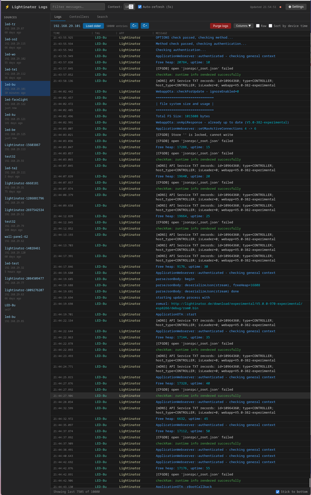
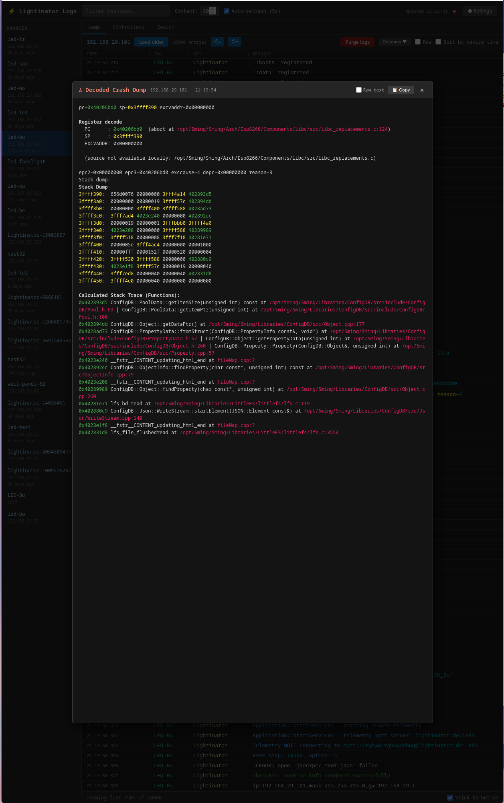
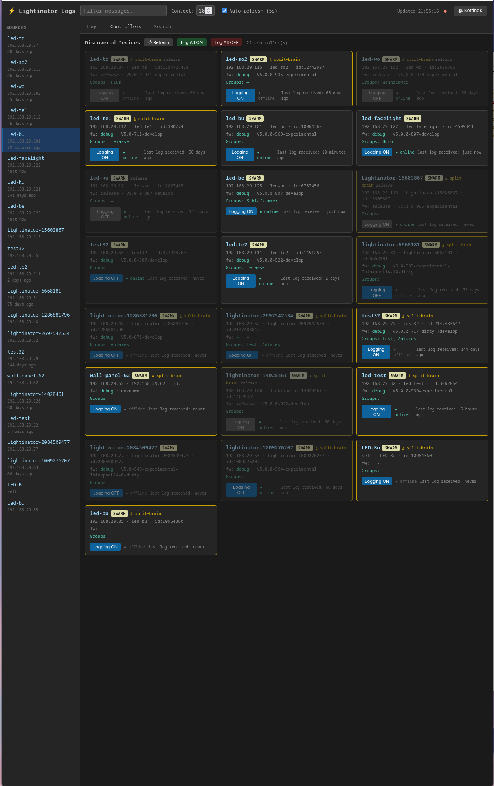
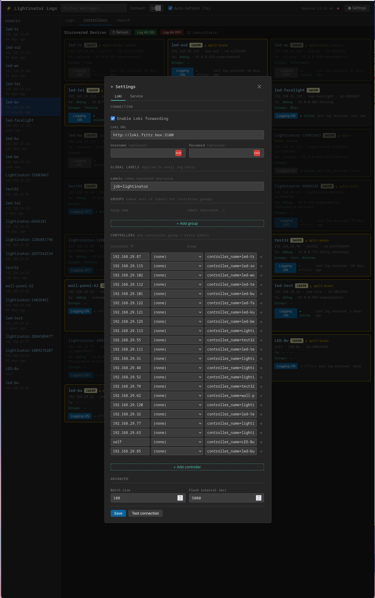

# Lightinator Log Service
[](https://github.com/pljakobs/lightinator-log-service/actions/workflows/container-image.yml)

Local-first UDP syslog collector, crash decoder and diagnostic viewer for
Lightinator controllers. It runs as a single Node.js container next to your
controllers. It stores logs in SQLite, symbolicates crash dumps against the
matching firmware build, can run AI-assisted root-cause analysis, and can forward
logs to Grafana Loki.

- [Features](#features)
- [Installation](#installation)
- [Configuration](#configuration)
- [Crash Decoding](#crash-decoding)
- [Credentials and API Security](#credentials-and-api-security)
- [Controller Firmware Updates](#controller-firmware-updates)
- [Configuration Upgrades](#configuration-upgrades)
- [AI Providers and Context](#ai-providers-and-context)
- [Storage and Decoder Validation](#storage-and-decoder-validation)
- [GitHub Issue Reporting](#github-issue-reporting)
- [Loki Forwarding](#loki-forwarding)
- [Controller Discovery](#controller-discovery)
- [API](#api)
- [Development and CI](#development-and-ci)

## Features

The browser UI is served at `http://<host>:4821/` (or
`http://lightinator-logservice.local:4821/` via mDNS). There is no frontend build
step. The UI is plain HTML, CSS and ES modules. DOMPurify is served locally; the
ANSI (`ansi_up`) and Markdown (`marked`) renderers load from jsDelivr.

The header shows the build number, the Loki connection state and a settings
button. Click the build number to open a **What's new** dialog listing the
changes in each CI build.

### Logs



- Per-controller log stream with time, tag, application and message columns.
  Columns are resizable and can be hidden. A raw mode shows the original line.
- Live refresh without gaps; the viewport stays where it is while you are
  scrolled away from the tail. *Jump to end* returns to live mode.
- Infinite scroll loads older entries.
- Severity colouring and ANSI colour rendering.
- Free-text filter with configurable context lines. Non-matching lines are
  dimmed, and gaps between context groups are marked with dividers.
- Optional sorting by device time, for replaying out-of-order drains.
- `Ctrl+A` selects only the log content.
- Per-controller purge.

### Boot tracking

- Every reboot is detected from the per-boot nonce in the firmware's syslog
  prefix and shown as one reboot marker per boot.
- A boot picker lists all boots of a controller and jumps to the start of a
  boot. *Previous/next boot* buttons step between markers, including boots
  outside the loaded window.
- Firmware metadata (firmware version, Sming version, SoC and build type) is
  recorded per boot generation. A crash is always decoded against the build that
  was running when it happened, not the controller's current firmware.

### Search

The **Search** tab searches all controllers at once, with configurable context
lines around each match.

### Crashes



- Crash dumps are detected in the incoming syslog stream (ESP8266 exceptions,
  ESP32 Guru Meditation panics and the firmware's crash-dump report). They are
  collected and symbolicated automatically; see [Crash Decoding](#crash-decoding).
- The **Crashes** tab lists all decoded crashes, with jump-to-log and links to
  their GitHub issues.
- The crash modal shows the decoded stack trace, disassembly around the faulting
  address, source context and the optional AI analysis. You can switch between
  raw and decoded output and copy either to the clipboard. Crash Markdown is
  sanitized before it is rendered.
- **Re-decode** reruns only the decoder, using the stored raw dump and the
  original build metadata. **Analyze** runs the AI analysis on demand, even when
  automatic analysis is disabled.

### Controllers



- Card grid of discovered Lightinator controllers and wall panels: name, IP,
  hostname, device ID, device class, group memberships, firmware version, build
  type, and either an online indicator or the time the last log was received.
- Per-controller **Logging ON/OFF**, plus *Log all ON/OFF*. With
  `LLS_SYSLOG_ADVERTISE_HOST` set (or auto-detected), the toggle also
  reconfigures the controller's rsyslog target.
- Remove single controllers, a selection, or all controllers not seen for N
  days, optionally including their logs. Stale controllers are removed hourly
  after `LLS_CONTROLLER_STALE_DAYS`.
- Opt-in single-controller firmware ROM updates; see
  [Controller Firmware Updates](#controller-firmware-updates).

### Settings



The settings dialog has four tabs: **Service**, **Loki**, **AI** and **GitHub**.
Forms are typed and credentials are write-only. Service settings are written to
`data/service.env` and apply after a restart, which you can trigger from the UI.
Loki settings apply immediately.

### Mobile

On phones and tablets, controller selection opens in a slide-out drawer. Log
metadata stacks above each message, controller cards and crash rows wrap, and
decoded crashes use a fullscreen modal with independently scrollable code
blocks. Layouts are tested at 320, 390 and 768 px.

## Installation

The container image is published to `ghcr.io/pljakobs/lightinator-log-service`
for `linux/amd64` and `linux/arm64`:

| Tag | Source |
|---|---|
| `prod` | `prod` branch (stable, recommended) |
| `develop` | `develop` branch (latest development build) |
| `latest` | default branch |
| `sha-<commit>`, `v*` | individual commits and release tags |

The service needs **host networking** for UDP syslog reception and mDNS.

### Interactive installer

```bash
git clone https://github.com/pljakobs/lightinator-log-service.git
cd lightinator-log-service
./install.sh
```

The installer detects the init system (Podman Quadlet, systemd with
podman/docker, or OpenRC). It asks for a system-wide or per-user install and for
the `prod` or `develop` image. It then creates the data directory and
`service.env`, and migrates older non-template Quadlet units.

### Podman Quadlet (recommended)

[quadlet/lightinator-log-service@.container](quadlet/lightinator-log-service@.container)
is a template unit; the instance name selects the image tag:

```bash
sudo mkdir -p /var/lib/lightinator-log-service/data
sudo cp quadlet/lightinator-log-service@.container /etc/containers/systemd/
sudo cp config/service.env.example /var/lib/lightinator-log-service/data/service.env
sudo systemctl daemon-reload
sudo systemctl start lightinator-log-service@prod      # or @develop
sudo systemctl enable --now podman-auto-update.timer   # optional
```

`systemctl restart lightinator-log-service@<tag>` pulls the newest image before
starting. `AutoUpdate=registry` lets `podman-auto-update` follow the registry.
Both instances share `/var/lib/lightinator-log-service/data`. For a per-user
install, copy the unit to `~/.config/containers/systemd/` and adjust `Volume=`
and `EnvironmentFile=` (see the comments in the unit file).

```bash
systemctl status lightinator-log-service@prod
journalctl -u lightinator-log-service@prod -f
```

### Helper scripts (no systemd)

```bash
./scripts/run-container.sh      # start
./scripts/update-container.sh   # pull latest image and recreate, keeping data
./scripts/stop-container.sh     # stop
```

The scripts use podman when it is available and docker otherwise. They are
configured with `LIGHTINATOR_LOG_IMAGE`, `LIGHTINATOR_LOG_CONTAINER_NAME`,
`LIGHTINATOR_LOG_HTTP_PORT`, `LIGHTINATOR_LOG_UDP_PORT` and
`LIGHTINATOR_LOG_DATA_DIR`.

### Compose and local builds

```bash
docker compose up -d --build                       # or: podman-compose up -d --build
docker compose --profile monitoring up -d          # adds Loki + Grafana (admin/admin, :3000)
```

```bash
podman build -t lightinator-log-service:dev -f Containerfile .
podman run -d --name lightinator-log-service --network host \
  -v ./data:/app/data lightinator-log-service:dev
```

`make help` lists the Makefile targets (`deps`, `run`, `docker-*`, `podman-*`,
and the multi-arch `docker-buildx-push` / `podman-manifest-push`):

```bash
make docker-buildx-push IMAGE=ghcr.io/<owner>/lightinator-log-service TAG=latest
make podman-manifest-push IMAGE=ghcr.io/<owner>/lightinator-log-service TAG=latest
```

### Runtime ports

- HTTP UI/API: `4821/tcp`
- Syslog ingest: `5514/udp` (must match `network.rsyslog.port` on the controllers)
- mDNS: `_lightinator-log._tcp` and `_lightinator-syslog._udp`

## Configuration

Runtime settings are `LLS_*` environment variables, normally kept in
`data/service.env` (see [config/service.env.example](config/service.env.example)).
Most of them can also be edited in the **Service**, **AI** and **GitHub** settings
tabs. Changes apply after a restart.

| Variable | Default | Description |
|---|---|---|
| `LLS_HTTP_HOST` | `0.0.0.0` | HTTP bind address |
| `LLS_HTTP_PORT` | `4821` | HTTP port |
| `LLS_UDP_HOST` | `0.0.0.0` | UDP syslog bind address |
| `LLS_UDP_PORT` | `5514` | UDP syslog port |
| `LLS_CORS_ORIGIN` | `*` | Allowed CORS origin |
| `LLS_SERVICE_NAME` | `LightinatorLogService` | Name in health responses and mDNS |
| `LLS_MDNS_HOST` | `lightinator-logservice.local` | Announced mDNS hostname |
| `LLS_SYSLOG_ADVERTISE_HOST` | auto-detected | Address pushed to controllers when logging is toggled |
| `LLS_DISCOVERY_SEEDS` | `lightinator.local` | Comma-separated seed controllers |
| `LLS_DISCOVERY_PORT` | `80` | Controller HTTP port |
| `LLS_DISCOVERY_REFRESH_MS` | `300000` | Discovery refresh interval |
| `LLS_CONTROLLER_STALE_DAYS` | `30` | Auto-remove controllers not seen for N days (`0` disables) |
| `LLS_RETENTION_DAYS` | `7` | Delete log rows older than N days (`0` disables) |
| `LLS_MAX_BYTES_PER_IP` | `20971520` | Stored log/crash text per controller (`0` disables) |
| `LLS_MAX_ROWS_PER_IP` | `10000` | Row cap per controller |
| `LLS_ELF_BASE_URL` | `http://lightinator.de/download` | Base URL of firmware ELF/map artifacts |
| `LLS_AI_ENABLED` | `true` | Run AI analysis automatically after decoding |
| `LLS_AI_BACKENDS` | Gemini default | Ordered JSON list of AI providers |
| `LLS_AI_CONTEXT_ROUNDS` | `3` | Maximum source-context request rounds |
| `LLS_AI_CONTEXT_BYTES` | `120000` | Aggregate source-context byte budget |
| `LLS_GEMINI_API_KEY` | — | Legacy Gemini key (also `GEMINI_API_KEY`, `GOOGLE_API_KEY`) |
| `GEMINI_MODEL` | `gemini-3.8-flash` | Legacy Gemini model (falls back through older flash models) |
| `LLS_GITHUB_TOKEN` | — | Token for crash issue creation |
| `LLS_GITHUB_REPO` | — | `owner/repo` (or GitHub URL) for crash issues |
| `LLS_AUTO_CREATE_ISSUES` | `false` | Create/update GitHub issues for decoded crashes |
| `LLS_FIRMWARE_UPDATES_ENABLED` | `false` | Enable OTA updates from the UI |
| `LLS_FIRMWARE_API_URL` | `https://lightinator.de/api` | Firmware catalogue API |

Deployment-only paths are not exposed through the API or UI. In the container
they default to locations under `/app/data`:

| Variable | Default | Content |
|---|---|---|
| `LLS_DB_PATH` | `data/db.sqlite` | SQLite database (logs, boots, crashes) |
| `LLS_SERVICE_ENV` | `data/service.env` | Runtime configuration file |
| `LLS_LOKI_CONFIG` | `data/loki.json` | Loki settings |
| `LLS_CONTROLLER_STATE` | `data/controllers.json` | Persisted controller inventory |
| `LLS_ELF_CACHE_DIR` | `data/elfs` | Downloaded ELF and map files |
| `LLS_DATA_DIR` | `data/logs` | Legacy NDJSON logs, imported once on startup |

Firmware source checkouts used for crash context are cached in
`data/context_cache`.

## Crash Decoding

1. **Detection.** A crash trigger in the syslog stream (`Fatal exception`,
   `Guru Meditation Error`, `pc=… sp=… excvaddr=…`, `epc1=…`) starts collection
   of the following register and stack lines. Logger prefixes are stripped, and
   truncated stack data is recovered from the stored log when a decode is rerun.
2. **Build resolution.** The firmware version, Sming version, SoC and build type
   are taken from the metadata recorded for the boot in which the crash
   happened. They are stored with the crash record.
3. **Artifacts.** The ELF and map file are downloaded once into the cache from:

   ```
   <LLS_ELF_BASE_URL>/<branch>/<firmware-version>/<soc>/<debug|release>/app_0.out   (ESP8266)
   <LLS_ELF_BASE_URL>/<branch>/<firmware-version>/<soc>/<debug|release>/app.out     (ESP32, ESP32-C3)
   ```

   `<branch>` is derived from the version string (`V5.0.0-990-experimental` →
   `experimental`). The `.map` file is fetched from the same directory. HTTP and
   HTTPS URLs and redirects are supported.
4. **Decoding.** The vendored, map-aware decoders in [tools/](tools/)
   (`decode-esp8266.py`, `decode-esp32.py`) symbolicate PCs and stack words,
   classify code and data addresses, and add disassembly around the faulting
   address.
5. **Source context.** The firmware and Sming repositories are checked out at
   the crash's version tags, including submodules. Snippets for the decoded
   frames are attached, and source retrieval cannot leave the repository.
6. **Analysis and reporting.** Optional AI analysis and optional GitHub issue
   creation run afterwards. Decode, analysis and storage are serialized per
   crash, so one failed job does not block the queue.

Supported SoCs: ESP8266, ESP32 and ESP32-C3. The Espressif toolchains used for
decoding are defined in
[config/decoder-toolchains.json](config/decoder-toolchains.json); see
[Storage and Decoder Validation](#storage-and-decoder-validation) for how the
container installs and checks them.

## Credentials and API Security

GitHub tokens, Gemini API keys, and Loki passwords are write-only through the
HTTP API. Settings reads return `credentialsConfigured` flags for service keys
and `passwordConfigured` for Loki, not existing secret values. The UI displays
empty password inputs and configured-state indicators.

Omit a secret or send an empty string to keep it unchanged. Send a new value to
replace it, or JSON `null` to clear it explicitly. Service keys take effect after
a service restart; Loki changes apply immediately. Changing the Loki URL or
username requires replacing or clearing its password.

Backend integrations obtain credentials directly from private configuration and
the persisted settings, never through HTTP. No caller-locality exception is
needed. Saved configuration files use owner-only permissions but still contain
plaintext credentials; protect the host, data volume, and backups accordingly.

Authentication and authorization for configuration writes and destructive APIs
are not implemented. Restrict network access using a firewall or authenticated
reverse proxy before exposing the service beyond a trusted network. Write-only
credentials do not prevent unauthorized changes, deletion, or restart.

Storage, cache, migration-source, and bootstrap file paths are deployment-only
environment settings. They are not returned by the public settings/service-info
APIs and cannot be changed through the UI. Existing deployment paths are retained
when user-facing settings are saved.

## Controller Firmware Updates

Single-controller ROM updates are available from each controller card. Enable
`LLS_FIRMWARE_UPDATES_ENABLED=true` in Service settings and restart; updates are
disabled by default. `LLS_FIRMWARE_API_URL` defaults to
`https://lightinator.de/api` and uses its SoC/branch/build-type/version catalogue.
Select a version, review the target, and explicitly confirm installation.

The optional OTA password is used once with the controller's `admin` Basic-auth
account, never saved or returned by the service, and cleared from the form.
Commands are not automatically resent after an ambiguous network failure.
Disconnects are not success: the controller must report the selected firmware
version, SoC, and build type before the job is marked installed. Monitoring
continues when the dialog is closed; recent jobs are kept in memory, not across
service restarts.

This first implementation updates firmware ROMs only, not webapp/filesystem
artifacts or entire swarms. It is isolated from Vue/Python UIs for later shared
client extraction. Supported legacy Lightinator devices lack explicit firmware
identity; devices that advertise a different firmware ID are refused.

OTA is a destructive operation. Restrict access using a trusted network or an
authenticated reverse proxy before enabling it; the opt-in and same-origin
browser checks do not replace service authentication. Device API traffic uses
the controller's existing HTTP protocol, so keep OTA credentials on a trusted
network. Tests use local controller/catalogue fixtures and do not flash devices.

## Configuration Upgrades

Existing GitHub tokens, Gemini key aliases, selected Gemini models, provider
ladders, and Loki credentials remain usable when the new image starts. Legacy
quoted environment-file values are normalized in memory; the file is not
rewritten just to adapt the default Gemini backend. Keep the same mounted data
volume and deployment environment when replacing a container.

The installer does not need to run again for data/configuration migration.
Once the new image is published for the installed tag, restarting a current
template Quadlet service pulls and recreates the container. A plain
`podman restart` or `docker restart` keeps using the old image: pull and recreate
instead. Older non-template units also require an explicit image update. Reuse
the same image tag, data mount, and environment-file configuration.

Legacy Loki credentials embedded in the URL are moved to the private username
and password fields for the same destination. That migration writes atomically
and retains `loki.json.pre-write-only.bak` with owner-only permissions. Treat the
backup as sensitive. If the data volume is read-only, the credentials remain
usable in memory and the service reports that persistence was unavailable.

## AI Providers and Context

Settings open on Service, followed by Loki, AI, and GitHub tabs. The AI tab
controls automatic analysis, provider order, model fallback lists, endpoints,
write-only tokens, maximum context rounds, and the aggregate source-byte budget.
Changes take effect after restarting the service.

`LLS_AI_BACKENDS` is a JSON array tried in order. Each entry has `id`, `type`
(`gemini`, `openai`, or `ollama`), `baseUrl`, `models`, and an optional `token`.
OpenAI-compatible endpoints include local Ollama, vLLM, and LM Studio servers;
the `ollama` type uses Ollama's native API. Models must already be available on
the selected backend. With host networking, a local backend can use loopback.

```dotenv
LLS_AI_BACKENDS=[{"id":"local","type":"ollama","baseUrl":"http://127.0.0.1:11434","models":["qwen3:8b"]}]
LLS_AI_CONTEXT_ROUNDS=3
LLS_AI_CONTEXT_BYTES=120000
LLS_AI_ENABLED=true
```

The legacy Gemini key/model settings provide the default backend when no
provider list is configured. Keeping that default in the UI retains a reference
to the legacy key rather than duplicating it. Explicit backend tokens are
independent. Reads expose only `tokenConfigured`, and changing a credential's
provider type or destination requires replacing or explicitly clearing it.

Intermediate passes request prioritized source ranges, optionally expanding to
full files within the byte budget. Only the final report is displayed and stored;
unresolved requests and budget limits are supplied to the final pass. These
controls improve grounding but do not guarantee hallucination-free results.
Disabling automatic analysis does not disable an explicitly requested manual
analysis.

## Storage and Decoder Validation

`LLS_RETENTION_DAYS` prunes expired log rows. `LLS_MAX_BYTES_PER_IP` limits stored
UTF-8 log/crash text per controller, excluding SQLite indexes and page overhead.
Zero disables either limit. Pruning runs on startup, inserts, crash updates, and
every five minutes; row-count limits continue to apply. Associated crash-report
records are deleted through SQLite foreign-key cascades.

Row and byte usage totals are maintained by SQLite triggers so normal ingestion
does not rescan retained log text. Startup migrations, imports, initial pruning,
and boot/controller-state restoration run in a worker before listeners become
ready. Independent Loki loading and repository setup overlap; complete crash
analysis jobs remain serialized. Ordinary runtime SQLite calls remain synchronous.

Collected crash dumps and original firmware metadata are persisted separately
from the received syslog record. Manual analysis uses that original build, not
the controller's current firmware. Historical crashes without original metadata
cannot be reliably re-analyzed and report that limitation.

Both container recipes install native AMD64/ARM64 host binutils, including
addr2line, nm, and objdump. Espressif archives are version-pinned and verified
against SHA256 checksums. Each build stage assembles fixture ELFs and checks
source context and disassembly for ESP8266, ESP32, and ESP32-C3. Repeat the smoke
check in a built image with:

```bash
podman run --rm --entrypoint node lightinator-log-service:dev /app/scripts/test-decoder-tools.js
```

## GitHub Issue Reporting

With `LLS_AUTO_CREATE_ISSUES=true`, `LLS_GITHUB_TOKEN` and `LLS_GITHUB_REPO` set
(GitHub settings tab), each decoded crash is fingerprinted from the exception
cause and its top PC/stack frames. If an issue with that fingerprint already
exists, the crash is linked to it. Otherwise a new issue is created with device
metadata, the top frames, the AI analysis (if any) and the decoded stack trace,
labelled `crash-report` and `ai-analyzed`. Issue links appear in the Crashes tab.

## Loki Forwarding

Log entries are buffered and pushed in batches to any Loki-compatible endpoint
(`/loki/api/v1/push`). Configure it in the **Loki** settings tab: URL, username,
password (write-only), batch size and flush interval. **Test** pushes a test
entry with the current form values and reports the target and the response. A
status dot in the header shows the connection state.

Labels are resolved in this order, later ones overriding earlier ones:

1. Global labels
2. Group labels (matched by the group names found by discovery)
3. Per-controller labels

Every stream also gets a `host` label (the syslog tag / controller name).
Settings are stored in `data/loki.json`. For local testing,
`docker compose --profile monitoring up -d` starts Loki and Grafana with a
provisioned datasource (`http://localhost:3000`, admin/admin).

## Controller Discovery

Discovery runs on the first packet from an unknown IP, every
`LLS_DISCOVERY_REFRESH_MS`, and on demand. It:

1. Queries `/hosts?all=true` on a seed controller (`LLS_DISCOVERY_SEEDS`, with
   previously known controllers as fallback seeds) to list all peers.
2. Queries `/data` for groups and controllers, then cross-joins both into an
   inventory with group memberships.
3. Polls `/info?v=2` per controller for the boot nonce, firmware and Sming
   versions, SoC and build type. Throttled polls are retried. The results are
   attached to the matching boot generation.
4. Classifies wall panels via mDNS service discovery, without HTTP.
5. Persists the inventory to `data/controllers.json` and feeds group names into
   the Loki label pipeline.

## API

All endpoints return JSON. There is no authentication; see
[Credentials and API Security](#credentials-and-api-security).

### Service

| Method | Path | Description |
|---|---|---|
| GET | `/health`, `/api/v1/health` | Health and version |
| GET | `/api/info` | Build number and git version |
| GET | `/api/v1/service-info` | Ports, collector IPv4 addresses, mDNS services, capabilities |
| GET | `/api/v1/changelog` | Per-build change list (What's new) |
| GET | `/api/v1/service-config` | Public service settings (credentials as configured-flags only) |
| POST | `/api/v1/service-config` | Write `service.env` (`{ values }`); restart required |
| POST | `/api/v1/service-config/restart` | Exit the process so the supervisor restarts it |

### Logs, boots and search

| Method | Path | Description |
|---|---|---|
| GET | `/api/v1/sources` | Controllers that have sent logs |
| GET | `/api/v1/logs?ip=&limit=&before=&from=` | Paged logs, newest first (`before` = offset from newest, `from` = id) |
| DELETE | `/api/v1/logs?ip=` / `?all=true` | Purge one controller / all logs |
| GET | `/api/v1/boots?ip=` | Boots of a controller: first/last log id, time range, entry and crash counts |
| GET | `/api/v1/logs/boot-jump?ip=&currentId=&direction=prev\|next` | Neighbouring boot marker |
| GET | `/api/v1/search?q=&limit=&context=` | Search across all controllers |

### Crashes

| Method | Path | Description |
|---|---|---|
| GET | `/api/v1/crashes?ip=&limit=` | Decoded crashes |
| GET | `/api/v1/logs/:id/crash-decode` | Decode, raw dump and build metadata of a crash |
| POST | `/api/v1/crashes/:id/decode` | Re-run the decoder only |
| POST | `/api/v1/crashes/:id/analyze` | Run AI analysis |

### Controllers

| Method | Path | Description |
|---|---|---|
| GET | `/api/v1/controllers` | Inventory and `firmwareUpdatesEnabled` |
| POST | `/api/v1/controllers/refresh` | Run discovery now |
| PATCH | `/api/v1/controllers/:ip/logging` | `{ "enabled": bool }`; also reconfigures controller rsyslog |
| DELETE | `/api/v1/controllers/:ip?purgeLogs=true` | Remove a controller |
| POST | `/api/v1/controllers/remove` | `{ ips: [...], purgeLogs }` |
| POST | `/api/v1/controllers/remove-stale` | `{ days, purgeLogs }` |
| GET | `/api/v1/controllers/:ip/firmware?branch=&type=` | Firmware update options |
| POST | `/api/v1/controllers/:ip/firmware` | Start an update job (same-origin only) |
| GET | `/api/v1/controllers/:ip/firmware/:jobId` | Update job status |

### Loki

| Method | Path | Description |
|---|---|---|
| GET | `/api/v1/loki/status` | Connection/forwarding status |
| GET | `/api/v1/loki/config` | Settings (`passwordConfigured`, no password) |
| PUT | `/api/v1/loki/config` | Update settings |
| POST | `/api/v1/loki/test` | Push a test entry |

## Development and CI

```bash
npm ci
npm run dev          # node --watch src/index.js
npm test             # unit and integration tests (node:test)
npm run test:e2e     # Playwright UI tests against a fixture server
npm run changelog    # regenerate src/changelog.json from build/* tags
```

Node.js ≥ 20 is required; CI tests on Node 22 and 24.

The workflow [.github/workflows/container-image.yml](.github/workflows/container-image.yml)
runs on pushes and pull requests to `main`, `master`, `develop` and `prod`, and
on `v*` tags:

- Unit/integration tests run on Node 22 and 24, followed by the Playwright tests.
  JUnit, HTML reports and failure traces are published as job summaries, checks
  and artifacts (kept for 14 days). Any failure blocks the image build.
- Pull requests build the multi-arch image without pushing.
- Pushes build and publish `linux/amd64` + `linux/arm64` images to GHCR. Each
  published build is tagged `build/<run-number>` in git; these tags define the
  per-build entries of the What's new dialog.

Design notes and plans: [DESIGN.md](DESIGN.md),
[FIRMWARE_AGNOSTIC_PLAN.md](FIRMWARE_AGNOSTIC_PLAN.md),
[CRASH_REPORT_MODULE_PLAN.md](CRASH_REPORT_MODULE_PLAN.md).


